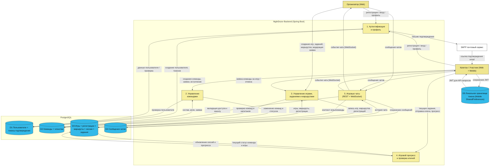

# NightDozor Data Flow Diagram (DFD)

```mermaid
flowchart TB
  classDef entity fill:#efe58f,stroke:#2e2e2e,stroke-width:1px,color:#111;
  classDef process fill:#f7ef9e,stroke:#2e2e2e,stroke-width:1px,color:#111;
  classDef store fill:#33b9e8,stroke:#2e2e2e,stroke-width:1px,color:#111;
  classDef external fill:#ffffff,stroke:#2e2e2e,stroke-width:1px,color:#111;

  ORG["Организатор (Web)"]:::entity
  USER["Капитан / Участник (Web + Mobile)"]:::entity
  MAIL["SMTP почтовый сервис"]:::external
  LOCAL[("D5 Локальное хранилище токена (Mobile SharedPreferences)")]:::store

  subgraph BACK["NightDozor Backend (Spring Boot)"]
    P1["1. Аутентификация<br/>и профиль"]:::process
    P2["2. Управление<br/>командами"]:::process
    P3["3. Управление играми,<br/>заданиями и маршрутами"]:::process
    P4["4. Игровой прогресс<br/>и проверка ключей"]:::process
    P5["5. Игровые чаты<br/>(REST + WebSocket)"]:::process
  end

  subgraph DB["PostgreSQL"]
    D1[("D1 Пользователи + токены подтверждения")]:::store
    D2[("D2 Команды + членства")]:::store
    D3[("D3 Игры + регистрации + маршруты + сессии + задания")]:::store
    D4[("D4 Сообщения чатов")]:::store
  end

  ORG -->|"регистрация / вход / профиль"| P1
  USER -->|"регистрация / вход / профиль"| P1
  P1 -->|"создание пользователя, токенов"| D1
  D1 -->|"данные пользователя / проверка"| P1
  P1 -->|"письмо подтверждения"| MAIL
  MAIL -->|"ссылка подтверждения email"| USER

  USER -->|"создание команды, заявки, вступление"| P2
  P2 -->|"изменение команд и статусов"| D2
  D2 -->|"состав, роли, заявки"| P2
  P2 -->|"проверка пользователя"| D1

  ORG -->|"создание игр, заданий, маршрутов, модерация заявок"| P3
  USER -->|"заявка команды на игру / отмена"| P3
  P3 -->|"запись игр, маршрутов, регистраций"| D3
  D3 -->|"игры, маршруты, регистрации"| P3
  P3 -->|"проверка команд и капитанов"| D2

  USER -->|"текущее задание, отправка ключа, прогресс"| P4
  P4 -->|"обновление сессий и прогресса"| D3
  D3 -->|"текущий статус команды и игры"| P4

  ORG -->|"сообщения чатов"| P5
  USER -->|"сообщения чатов"| P5
  P5 -->|"сохранение сообщений"| D4
  D4 -->|"история чата"| P5
  P5 -->|"валидация доступа к каналу"| D2
  P5 -->|"контекст игры/команды"| D3
  P5 -->|"события чата (WebSocket)"| ORG
  P5 -->|"события чата (WebSocket)"| USER

  USER -->|"сохранение JWT"| LOCAL
  LOCAL -->|"JWT для API-запросов"| USER
```

